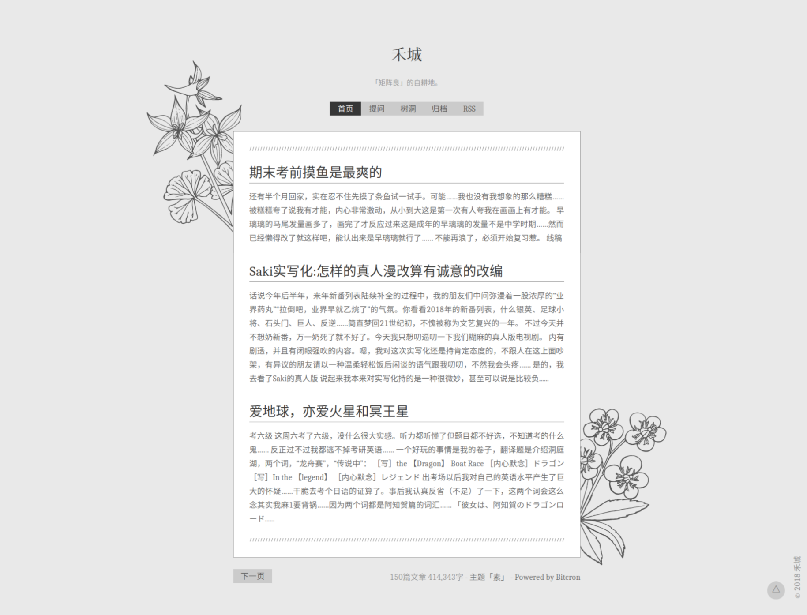
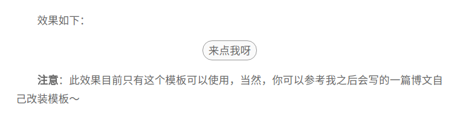
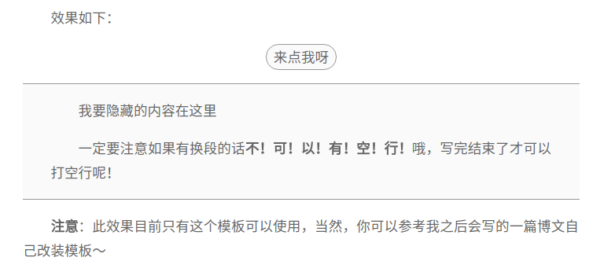
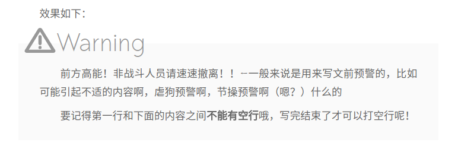

# Bitcron主题「素」

「素」效果图：




```table
| 名称 | 链接 |
| 主题 | 素 |
| 英文 | Plain |
| 说明 | [这里](/post/zi-zhi/bitcron-theme-plain) |
| 源码 | [这里](https://github.com/matrixk/bitcron-theme-plain) |
| 属性 | 开源 |
```

# 关于「素」

这个模板基于[Baco的「淡泊」](https://blog.shuiba.co/bitcron-theme-light)魔改而来~~，所谓Bitcron届59改？~~[^59改]如果你觉得好看，九成九是因为Baco的样式写得好看，正文样式和评论样式我都没怎么动（……），去给她打钱吧！

[^59改]: 59式坦克改，魔改方案特别多，甚至改到妈不认，成为军坛一梗。所谓“一二三四五五五”“远看炮塔吓死人，近看五对负重轮”也是这个梗。

**名字来源**就是因为长得素，黑白灰配色嘛。~~虽然因为我做这个主题的时候正在补《白夜追凶》，一度想给它起名叫「白夜」。~~

**基础设计**其实是我学期中一晚上瞎搞出来的[树洞页](/post/meme)的设计，琢磨了一下拿来扩成了一个主题。

两天爆肝成品，可能还有Bug没调整过来，如果大家用着发现有Bug记得评论跟我说。

鼠标悬停在站点名字上的时候**有特效**，我自己调戏了好久哦……

其实还有一个功能想实现，但是还没找到办法，正在骚扰小海龙，如果改好了会更新说明的。

其他没啥好说的了\_(:зゝ∠)\_

# 使用方法

在[Github](https://github.com/matrixk/bitcron-theme-plain)上下载源代码，然后把`template`放到你的根目录下就好了～

如果根目录下已有`template`文件夹，请直接覆盖ww

## 2018-01-25 更新：文本折叠功能

**猛虎落地式大力感谢小海龙[@风海流](https://weibo.com/seadragondrift)的代码！！革命友谊地久天长！！！**

文本折叠功能使用方法：

在md文档中书写：

```
{{来点我呀}}
我要隐藏的内容在这里
一定要注意如果有换段的话**不！可！以！有！空！行！**哦，写完结束了才可以打空行呢！
```




## 2018-01-27 更新：预警！前方高能！

同样还是小海龙的代码，我大概知道效果惹！用这段代码可以自定义好多好多好多语法，**强无敌**，等我开新文章了来这里链个链接。

**使用方法**：在md文档中书写：

```
!Attention
前方高能！非战斗人员请速速撤离！！←一般来说是用来写文前预警的，比如可能引起不适的内容啊，虐狗预警啊，节操预警啊（嗯？）什么的
要记得第一行和下面的内容之间**不能有空行**哦，写完结束了才可以打空行呢！
```



# 更新日志

- 2018-01-20 发布主题
- 2018-01-19 开始肝主题

# 一些说明

- 因为主题确实颜色很素，所以我给文章中的图片都加了一个去色滤镜，鼠标悬停的时候才会显示出原来的颜色，其实对图片呈现效果不是很好。所以**此主题不适合博客内容大部分都是图片的摄影师和插画师**，比较适合我这种就喜欢叨逼叨的文字博主。
- 在`post.jade`里我保留了特殊模板的接口，但是没有把我自己的特殊模板上传到Github上……如果不用使用特殊模板的话不用理它，强迫症的话可以删掉开头那段`if`。
- 这个模板我没跟[上一个主题「正则」](/post/zi-zhi/bitcron-theme-canonical)一样设置取消缩进的`metadata`，如果需要的话可以自己对照「正则」的代码改一下。
- 其他想到了再补充……
